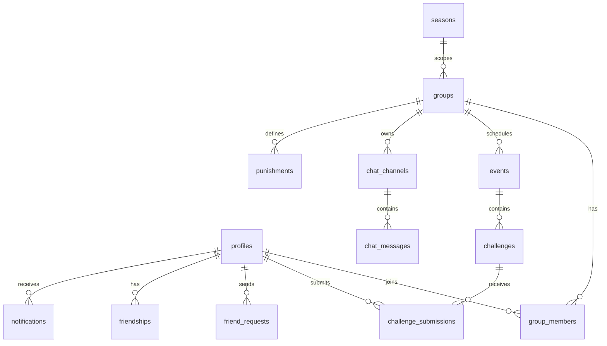

# IRL — Technical Architecture Document

**Version:** 1.0  
**Status:** Pre-Development  
**Stack:** Next.js 15 · TypeScript · Tailwind CSS · shadcn/ui · Framer Motion · Supabase · Vercel  
**Scope:** Architecture only — no application implementation in this document.

---

## Table of Contents

1. [Architecture Overview](#1-architecture-overview)
2. [System Context & Principles](#2-system-context--principles)
3. [Next.js 15 Application Structure](#3-nextjs-15-application-structure)
4. [Supabase Database Schema](#4-supabase-database-schema)
5. [Database Relationships](#5-database-relationships)
6. [Row Level Security (RLS)](#6-row-level-security-rls)
7. [Authentication & Authorization](#7-authentication--authorization)
8. [Realtime Architecture](#8-realtime-architecture)
9. [Storage Architecture](#9-storage-architecture)
10. [TypeScript Types](#10-typescript-types)
11. [API & Server Action Design](#11-api--server-action-design)
12. [State Management Strategy](#12-state-management-strategy)
13. [Background Jobs & Edge Functions](#13-background-jobs--edge-functions)
14. [Caching, Indexing & Performance](#14-caching-indexing--performance)
15. [Security Architecture](#15-security-architecture)
16. [Deployment Plan](#16-deployment-plan)
17. [Environment & Configuration](#17-environment--configuration)
18. [Scalability Roadmap](#18-scalability-roadmap)

---

## 1. Architecture Overview

SummerQuest is a **BFF-style Next.js application** backed by **Supabase** as the system of record for auth, Postgres, realtime, and object storage. The client talks to Supabase through:

- **Server Components & Server Actions** (preferred for reads/mutations with RLS)
- **Supabase Realtime** (chat, notifications, presence, live leaderboards)
- **Minimal Route Handlers** (webhooks, signed uploads, admin exports, Wrapped generation triggers)

```
┌─────────────────────────────────────────────────────────────────────────┐
│                         Vercel (Next.js 15)                              │
│  ┌──────────────┐  ┌──────────────┐  ┌──────────────┐  ┌─────────────┐ │
│  │ App Router   │  │ Server       │  │ Route        │  │ Middleware  │ │
│  │ (RSC + UI)   │  │ Actions      │  │ Handlers     │  │ (Auth)      │ │
│  └──────┬───────┘  └──────┬───────┘  └──────┬───────┘  └──────┬──────┘ │
│         │                 │                 │                  │        │
│         └─────────────────┴────────┬────────┴──────────────────┘        │
│                                    │                                       │
│                    @supabase/ssr (cookie session)                         │
└────────────────────────────────────┼──────────────────────────────────────┘
                                     │
         ┌───────────────────────────┼───────────────────────────┐
         ▼                           ▼                           ▼
┌─────────────────┐      ┌─────────────────────┐      ┌──────────────────┐
│ Supabase Auth   │      │ Supabase Postgres   │      │ Supabase Storage │
│ (JWT sessions)  │      │ + RLS + Realtime    │      │ (photos/proof)   │
└─────────────────┘      └──────────┬──────────┘      └──────────────────┘
                                    │
                         ┌──────────┴──────────┐
                         ▼                     ▼
                  Edge Functions          pg_cron (optional)
                  (event challenges,      (reminders, wrapped,
                   wrapped batch)           analytics rollup)
```

**Design tenets**

| Tenet | Implementation |
|-------|----------------|
| RLS is the authorization layer | All client-facing data access goes through policies; service role only in trusted server/edge paths |
| Events gate challenges | DB constraint + app invariant: challenges require `event_id` |
| Points/XP are server-derived | Awarded only via approved submissions / attendance triggers — never client-writable totals |
| Realtime for social surfaces | Chat, notifications, typing, presence; SSR for SEO-heavy public pages |
| Season-scoped data | `seasons` table anchors punishments, wrapped, leaderboards |

---

## 2. System Context & Principles

### 2.1 Domain modules

| Module | Primary tables | Realtime? |
|--------|----------------|-----------|
| Identity & profiles | `profiles` | Presence channel |
| Friends | `friend_requests`, `friendships` | Notifications |
| Groups | `groups`, `group_members`, `group_invitations` | Chat channels |
| Events | `events`, `event_rsvps`, `event_check_ins` | RSVP counts (optional) |
| Challenges | `challenge_templates`, `challenges`, `challenge_submissions` | Submission status |
| Gamification | `profiles` (aggregates), `user_streaks`, `achievements`, `user_achievements` | Level-up events |
| Punishments | `punishments`, `punishment_votes` | Vote tallies |
| Memories | `memories` (materialized from approved media) | — |
| Notifications | `notifications` | `postgres_changes` |
| Admin / analytics | `admin_audit_log`, `analytics_daily` | — |
| Summer Wrapped | `wrapped_snapshots` | — (batch generated) |

### 2.2 Role model

Roles are stored in **`profiles.role`** (`standard` | `group_admin` is contextual per group via `group_members.role`; global role is `global_admin`).

- **Standard user:** default on signup  
- **Group admin:** `group_members.role = 'admin'` for a specific `group_id`  
- **Global admin:** `profiles.role = 'global_admin'` (set only via service role / migration; never `user_metadata`)

Group-scoped permissions are evaluated with helper SQL functions (see §6).

---

## 3. Next.js 15 Application Structure

Uses **App Router**, **React 19**, **Server Components by default**, and route groups for layout isolation.

```
summerquest/
├── app/
│   ├── layout.tsx                    # Root: fonts, providers shell, Toaster
│   ├── globals.css
│   ├── not-found.tsx
│   ├── error.tsx
│   ├── loading.tsx
│   │
│   ├── (marketing)/                  # Public, no auth
│   │   ├── layout.tsx
│   │   └── page.tsx                  # Landing
│   │
│   ├── (auth)/                       # Auth layout (minimal chrome)
│   │   ├── layout.tsx
│   │   ├── login/page.tsx
│   │   ├── register/page.tsx
│   │   ├── forgot-password/page.tsx
│   │   ├── reset-password/page.tsx
│   │   └── verify-email/page.tsx
│   │
│   ├── (app)/                        # Authenticated shell (nav, notifications bell)
│   │   ├── layout.tsx                # Requires session; loads profile + unread count
│   │   ├── dashboard/page.tsx        # Home feed / activity
│   │   ├── friends/
│   │   │   ├── page.tsx              # Friends list + requests
│   │   │   └── search/page.tsx
│   │   ├── groups/
│   │   │   ├── page.tsx              # My groups
│   │   │   ├── new/page.tsx
│   │   │   └── [groupId]/
│   │   │       ├── page.tsx          # Group hub (tabs: chat, events, board, punishments)
│   │   │       ├── settings/page.tsx # Admin only
│   │   │       ├── events/
│   │   │       │   ├── page.tsx
│   │   │       │   ├── new/page.tsx  # Group admin
│   │   │       │   └── [eventId]/page.tsx
│   │   │       └── chat/[channel]/page.tsx  # Optional deep link
│   │   ├── events/
│   │   │   └── [eventId]/page.tsx    # Global event detail (if featured/global)
│   │   ├── leaderboard/
│   │   │   ├── page.tsx              # Global
│   │   │   └── group/[groupId]/page.tsx
│   │   ├── memories/page.tsx
│   │   ├── notifications/page.tsx
│   │   ├── profile/
│   │   │   ├── page.tsx              # Own profile
│   │   │   └── [username]/page.tsx
│   │   └── wrapped/
│   │       └── [seasonId]/page.tsx   # Summer Wrapped experience
│   │
│   ├── (admin)/                      # Global admin — separate layout + role guard
│   │   ├── layout.tsx
│   │   └── admin/
│   │       ├── page.tsx              # Analytics dashboard
│   │       ├── users/page.tsx
│   │       ├── groups/page.tsx
│   │       ├── events/page.tsx
│   │       ├── challenges/page.tsx   # Template pool
│   │       ├── submissions/page.tsx
│   │       ├── achievements/page.tsx
│   │       └── announcements/page.tsx
│   │
│   └── api/                          # Thin API surface — prefer Server Actions
│       ├── auth/callback/route.ts    # Supabase OAuth/email callback (if needed)
│       ├── webhooks/
│       │   └── supabase/route.ts     # DB webhooks → internal jobs (optional)
│       ├── upload/sign/route.ts      # Signed upload URL (service-validated)
│       └── cron/                     # Vercel Cron (protected by CRON_SECRET)
│           ├── event-reminders/route.ts
│           ├── analytics-rollup/route.ts
│           └── wrapped-pregenerate/route.ts
│
├── components/
│   ├── ui/                           # shadcn/ui primitives
│   ├── layout/                       # Nav, mobile tab bar, page transitions
│   ├── auth/
│   ├── friends/
│   ├── groups/
│   ├── events/
│   ├── challenges/
│   ├── chat/
│   ├── gamification/                 # XP popups, level bar, achievements, confetti
│   ├── leaderboard/
│   ├── memories/
│   ├── wrapped/
│   ├── notifications/
│   └── admin/
│
├── lib/
│   ├── supabase/
│   │   ├── client.ts                 # Browser client (singleton)
│   │   ├── server.ts                 # Server Component / Action client
│   │   ├── middleware.ts             # Session refresh for middleware
│   │   └── admin.ts                  # Service role — server-only, never imported in client components
│   ├── actions/                      # Server Actions grouped by domain
│   │   ├── auth.ts
│   │   ├── friends.ts
│   │   ├── groups.ts
│   │   ├── events.ts
│   │   ├── challenges.ts
│   │   ├── chat.ts
│   │   ├── punishments.ts
│   │   └── admin.ts
│   ├── queries/                      # Reusable server-side query builders
│   ├── hooks/                        # Client hooks (realtime, presence, infinite scroll)
│   ├── stores/                       # Zustand slices (UI-only ephemeral state)
│   ├── validators/                   # Zod schemas (shared client/server)
│   ├── gamification/                 # Level curve, XP tables (pure functions)
│   ├── constants/
│   └── utils/
│
├── types/
│   ├── database.ts                   # Generated from Supabase CLI
│   └── domain.ts                     # App-level types & enums
│
├── supabase/
│   ├── config.toml
│   ├── migrations/                   # Ordered SQL migrations
│   ├── seed.sql                      # Dev seed: templates, achievements
│   └── functions/                    # Edge Functions
│       ├── generate-event-challenges/
│       ├── process-submission/
│       ├── award-achievements/
│       └── generate-wrapped/
│
├── public/
├── middleware.ts                     # Auth session refresh + route protection
├── next.config.ts
├── tailwind.config.ts
├── components.json                   # shadcn
└── package.json
```

### 3.1 Routing & rendering strategy

| Route pattern | Rendering | Notes |
|---------------|-----------|-------|
| Marketing / auth | Static or SSR | Minimal JS |
| Group hub, event detail | RSC + streaming | Parallel data fetches per tab |
| Chat | Client island + Realtime | Hydrate message list; subscribe on mount |
| Leaderboards | RSC + short revalidate | `revalidate = 60` or realtime refresh on point awards |
| Admin | RSC + dynamic | `force-dynamic` where needed |
| Wrapped | Client-heavy | Precomputed JSON from `wrapped_snapshots` |

### 3.2 Middleware responsibilities

1. Refresh Supabase session cookies (`@supabase/ssr`).
2. Redirect unauthenticated users from `(app)` and `(admin)` to `/login`.
3. Redirect authenticated users away from `(auth)` to `/dashboard`.
4. Block `(admin)` unless JWT + DB role check passes (lightweight: check `profiles.role` via edge-safe cookie claim cache optional; full check in layout).

---

## 4. Supabase Database Schema

All tables live in `public` with **RLS enabled**. Use `uuid` primary keys, `timestamptz` for times, `created_at` / `updated_at` defaults.

### 4.1 Enums

```sql
CREATE TYPE user_role AS ENUM ('standard', 'global_admin');
CREATE TYPE group_member_role AS ENUM ('member', 'admin');
CREATE TYPE friend_request_status AS ENUM ('pending', 'accepted', 'rejected');
CREATE TYPE event_status AS ENUM ('scheduled', 'active', 'completed', 'cancelled');
CREATE TYPE rsvp_status AS ENUM ('going', 'maybe', 'not_going');
CREATE TYPE challenge_difficulty AS ENUM ('easy', 'medium', 'hard', 'legendary');
CREATE TYPE submission_status AS ENUM ('submitted', 'pending_review', 'approved', 'rejected');
CREATE TYPE chat_channel_type AS ENUM ('general', 'events', 'announcements');
CREATE TYPE notification_type AS ENUM (
  'friend_request', 'friend_accepted', 'event_invite', 'event_reminder',
  'challenge_approved', 'challenge_rejected', 'achievement_unlock',
  'level_up', 'punishment_vote', 'announcement', 'mention', 'group_invite'
);
CREATE TYPE punishment_vote_status AS ENUM ('draft', 'voting', 'locked');
```

### 4.2 Core tables

#### `seasons`
Platform-wide summer season container.

| Column | Type | Notes |
|--------|------|-------|
| id | uuid PK | |
| name | text | e.g. "Summer 2026" |
| starts_at | timestamptz | |
| ends_at | timestamptz | |
| is_active | boolean | One active season recommended |
| wrapped_released_at | timestamptz nullable | |

#### `profiles`
1:1 with `auth.users`.

| Column | Type | Notes |
|--------|------|-------|
| id | uuid PK FK → auth.users | |
| username | citext UNIQUE | Case-insensitive unique |
| display_name | text | |
| bio | text | |
| avatar_url | text | Storage path |
| role | user_role | Default `standard` |
| xp | integer | Denormalized; updated by triggers |
| points | integer | Season points |
| level | integer | Derived from XP curve |
| season_id | uuid FK → seasons | Current season binding |
| is_banned | boolean | |
| is_featured | boolean | |
| last_seen_at | timestamptz | Presence |
| created_at | timestamptz | |

#### `friend_requests`

| Column | Type |
|--------|------|
| id | uuid PK |
| sender_id | uuid FK → profiles |
| receiver_id | uuid FK → profiles |
| status | friend_request_status |
| created_at | timestamptz |

Unique partial index: one pending request per pair.

#### `friendships`
Canonical edge (ordered pair constraint via `user_a_id < user_b_id`).

| Column | Type |
|--------|------|
| id | uuid PK |
| user_a_id | uuid |
| user_b_id | uuid |
| created_at | timestamptz |

#### `groups`

| Column | Type |
|--------|------|
| id | uuid PK |
| season_id | uuid FK |
| name | text |
| description | text |
| avatar_url | text nullable |
| created_by | uuid FK → profiles |
| is_active | boolean |
| created_at | timestamptz |

#### `group_members`

| Column | Type |
|--------|------|
| id | uuid PK |
| group_id | uuid FK |
| user_id | uuid FK |
| role | group_member_role |
| points | integer | Group-scoped points for punishment ranking |
| joined_at | timestamptz |

Unique (`group_id`, `user_id`).

#### `group_invitations`

| Column | Type |
|--------|------|
| id | uuid PK |
| group_id | uuid FK |
| inviter_id | uuid FK |
| invitee_id | uuid FK |
| status | friend_request_status-like enum |
| created_at | timestamptz |

RLS: invitee must be friend of inviter (enforced in Server Action + optional trigger).

#### `events`

| Column | Type |
|--------|------|
| id | uuid PK |
| group_id | uuid FK nullable | Null = global event |
| season_id | uuid FK |
| title | text |
| description | text |
| location | text |
| location_geo | geography(Point) nullable | Future map features |
| starts_at | timestamptz |
| ends_at | timestamptz |
| organizer_id | uuid FK → profiles |
| max_attendance | integer nullable |
| status | event_status |
| is_featured | boolean |
| challenges_generated | boolean | Set true after edge function |
| created_at | timestamptz |

#### `event_rsvps`

| Column | Type |
|--------|------|
| id | uuid PK |
| event_id | uuid FK |
| user_id | uuid FK |
| status | rsvp_status |
| unique (event_id, user_id) | |

#### `event_check_ins`

| Column | Type |
|--------|------|
| id | uuid PK |
| event_id | uuid FK |
| user_id | uuid FK |
| proof_url | text nullable |
| checked_in_at | timestamptz |
| xp_awarded | boolean default false |

#### `challenge_templates`
Global admin-managed pool.

| Column | Type |
|--------|------|
| id | uuid PK |
| title | text |
| description | text |
| difficulty | challenge_difficulty |
| points_value | integer | 1, 3, 5, 10 |
| is_active | boolean |
| safety_tags | text[] | Moderation metadata |

#### `challenges`
Instances attached to an event (exactly 9 per event per PRD).

| Column | Type |
|--------|------|
| id | uuid PK |
| event_id | uuid FK NOT NULL |
| template_id | uuid FK nullable |
| title | text |
| description | text |
| difficulty | challenge_difficulty |
| points_value | integer |
| sort_order | smallint |

Check constraint: `(SELECT count(*) FROM challenges WHERE event_id = NEW.event_id) <= 9` enforced via trigger.

#### `challenge_submissions`

| Column | Type |
|--------|------|
| id | uuid PK |
| challenge_id | uuid FK |
| user_id | uuid FK |
| group_id | uuid FK | Denormalized for admin scope |
| photo_url | text |
| caption | text nullable |
| status | submission_status |
| reviewed_by | uuid FK nullable |
| rejection_reason | text nullable |
| submitted_at | timestamptz |
| reviewed_at | timestamptz nullable |

Unique partial: one approved submission per (challenge_id, user_id).

#### `achievements`

| Column | Type |
|--------|------|
| id | uuid PK |
| slug | text UNIQUE |
| name | text |
| description | text |
| badge_url | text |
| criteria_json | jsonb | Machine-readable rules |
| bonus_xp | integer |

#### `user_achievements`

| Column | Type |
|--------|------|
| id | uuid PK |
| user_id | uuid FK |
| achievement_id | uuid FK |
| unlocked_at | timestamptz |
| unique (user_id, achievement_id) | |

#### `user_streaks`

| Column | Type |
|--------|------|
| id | uuid PK |
| user_id | uuid FK |
| season_id | uuid FK |
| current_streak | integer |
| longest_streak | integer |
| last_activity_date | date |

#### `punishments`

| Column | Type |
|--------|------|
| id | uuid PK |
| group_id | uuid FK |
| season_id | uuid FK |
| submitted_by | uuid FK |
| description | text |
| status | punishment_vote_status |
| locked_at | timestamptz nullable |
| winning_punishment_id | uuid FK nullable self-reference |

#### `punishment_votes`

| Column | Type |
|--------|------|
| id | uuid PK |
| group_id | uuid FK |
| voter_id | uuid FK |
| punishment_id | uuid FK |
| unique (group_id, voter_id) | One vote per member |

#### `chat_channels`

| Column | Type |
|--------|------|
| id | uuid PK |
| group_id | uuid FK |
| channel_type | chat_channel_type |
| unique (group_id, channel_type) | 3 channels per group |

#### `chat_messages`

| Column | Type |
|--------|------|
| id | uuid PK |
| channel_id | uuid FK |
| sender_id | uuid FK |
| body | text nullable |
| image_url | text nullable |
| reply_to_id | uuid FK nullable |
| created_at | timestamptz |
| edited_at | timestamptz nullable |
| deleted_at | timestamptz nullable |

#### `chat_read_receipts`

| Column | Type |
|--------|------|
| channel_id | uuid FK |
| user_id | uuid FK |
| last_read_message_id | uuid FK |
| last_read_at | timestamptz |
| PK (channel_id, user_id) | |

#### `notifications`

| Column | Type |
|--------|------|
| id | uuid PK |
| user_id | uuid FK |
| type | notification_type |
| title | text |
| body | text |
| data | jsonb | Deep link payload |
| is_read | boolean default false |
| created_at | timestamptz |

#### `memories`
Curated gallery entries (from approved submissions + event photos).

| Column | Type |
|--------|------|
| id | uuid PK |
| user_id | uuid FK |
| group_id | uuid FK nullable |
| event_id | uuid FK nullable |
| challenge_submission_id | uuid FK nullable |
| photo_url | text |
| caption | text |
| created_at | timestamptz |

#### `wrapped_snapshots`
Precomputed Summer Wrapped payload per user per season.

| Column | Type |
|--------|------|
| id | uuid PK |
| user_id | uuid FK |
| season_id | uuid FK |
| payload | jsonb | Full slide data |
| generated_at | timestamptz |
| unique (user_id, season_id) | |

#### `analytics_daily` (admin)
Rollup metrics — written by cron, read only by global admins.

#### `admin_audit_log`
Who did what in admin panel (service role or global admin actions).

### 4.3 Database functions & triggers (summary)

| Function / trigger | Purpose |
|--------------------|---------|
| `handle_new_user()` | On `auth.users` insert → create `profiles` row |
| `generate_event_challenges(event_id)` | Pick 3+3+2+1 templates → insert `challenges` |
| `on_submission_approved()` | Award points, XP, group points, enqueue achievement check |
| `on_check_in()` | Award 25 XP, streak update |
| `recalculate_level(user_id)` | Map XP → level using threshold table |
| `update_streak(user_id)` | Attendance/challenge activity |
| `is_group_admin(user_id, group_id)` | RLS helper |
| `is_group_member(user_id, group_id)` | RLS helper |
| `is_global_admin()` | RLS helper |
| `friends_with(a, b)` | RLS helper |

Level thresholds stored in `level_thresholds` table or constant JSON in `lib/gamification`.

### 4.4 Views (security invoker)

```sql
CREATE VIEW group_leaderboard WITH (security_invoker = true) AS ...
CREATE VIEW global_leaderboard WITH (security_invoker = true) AS ...
CREATE VIEW user_memory_feed WITH (security_invoker = true) AS ...
```

Never use default security definer views in exposed schemas.

---

## 5. Database Relationships

```
auth.users 1──1 profiles
profiles 1──* friend_requests (as sender/receiver)
profiles *──* friendships (via user_a / user_b)
profiles *──* group_members *──1 groups
groups 1──* group_invitations
groups 1──3 chat_channels 1──* chat_messages
groups 1──* events 1──* challenges 1──* challenge_submissions
events 1──* event_rsvps / event_check_ins
profiles 1──* user_achievements *──1 achievements
groups 1──* punishments 1──* punishment_votes
profiles 1──* notifications
profiles 1──* memories
seasons 1──* groups, events, wrapped_snapshots
challenge_templates 1──* challenges (optional FK)
```

**ER diagram (Mermaid)**



**Referential integrity rules**

1. Deleting a group cascades to members, channels, messages, group-scoped events (or soft-delete `is_active`).
2. Deleting an event soft-deletes challenges; submissions retained for audit.
3. `challenge_submissions.group_id` must match the event's group (trigger validation).
4. Friend-only group invites: enforced before insert on `group_invitations`.

---

## 6. Row Level Security (RLS)

**Global rules**

- Enable RLS on every table in `public`.
- Use `(select auth.uid())` in policies for plan caching (Postgres 15+).
- Never authorize from `user_metadata`; use `profiles.role` and membership tables.
- UPDATE policies require matching SELECT policies.

### 6.1 Helper functions (in `private` schema or `public` with locked search_path)

```sql
-- Example signatures
is_global_admin() → boolean
is_group_member(p_group_id uuid) → boolean
is_group_admin(p_group_id uuid) → boolean
are_friends(p_other uuid) → boolean
```

### 6.2 Policy matrix (condensed)

| Table | SELECT | INSERT | UPDATE | DELETE |
|-------|--------|--------|--------|--------|
| profiles | Public read non-banned; own row full | — (trigger) | Own row; global admin all | Global admin |
| friend_requests | Sender or receiver | Sender creates | Receiver updates status | Sender cancel pending |
| friendships | Participants | — (via accept RPC) | — | Either participant |
| groups | Members + discoverable public metadata | Authenticated creator | Group admin / global admin | Group admin / global admin |
| group_members | Group members | Admin invite OR self join via invite | Admin promotes | Admin removes / self leave |
| group_invitations | Inviter + invitee | Inviter (must be friend) | Invitee accepts/rejects | Inviter pending only |
| events | Group members or global public featured | Group admin / global admin | Organizer or admin | Admin |
| event_rsvps | Group members | Self | Self | Self |
| event_check_ins | Group members | Self during event window | — | Admin |
| challenge_templates | Authenticated read active | Global admin | Global admin | Global admin |
| challenges | Group members for group's events | Service role / edge only | — | — |
| challenge_submissions | Submitter + group admins + global admin | Submitter (member) | Reviewer admins on status/reason | Admin |
| achievements | Public read | Global admin | Global admin | Global admin |
| user_achievements | Public read | Trigger / service only | — | — |
| chat_channels | Group members | Trigger on group create | — | — |
| chat_messages | Group members | Group members (not banned) | Sender edit window | Sender soft-delete / admin |
| chat_read_receipts | Own | Own upsert | Own | — |
| notifications | Own | Trigger / service | Own mark read | Own delete |
| punishments | Group members | Members (season start window) | — | — |
| punishment_votes | Group members | Member one vote | — | — |
| memories | Owner + friends optional / group members | Owner on approval hook | Owner caption | Owner / admin |
| wrapped_snapshots | Own | Service role | — | — |
| analytics_daily | Global admin | Service role | — | — |

### 6.3 Storage RLS (buckets)

| Bucket | Path pattern | Policies |
|--------|--------------|----------|
| `avatars` | `{user_id}/*` | Owner CRUD |
| `submission-proofs` | `{group_id}/{event_id}/{user_id}/*` | Member insert; read group members + admins |
| `chat-images` | `{group_id}/{channel_id}/*` | Member insert/read |
| `memories` | `{user_id}/*` | Owner + authenticated read per memory visibility |

Remember: **upsert requires INSERT + SELECT + UPDATE** on storage objects.

### 6.4 Realtime authorization

Enable Realtime on `chat_messages`, `notifications` with RLS-aligned broadcasts. Clients subscribe only to channels where `is_group_member` passes; use private channels:

`realtime:group:{groupId}:chat:{channelType}`

---

## 7. Authentication & Authorization

### 7.1 Auth methods

- **Primary:** Email + password with email verification (Supabase Auth).
- **Optional later:** OAuth (Apple/Google) — architecture leaves `auth/callback` route in place.

### 7.2 Session flow (Next.js 15 + `@supabase/ssr`)

```
Register/Login form (Client)
    → supabase.auth.signUp / signInWithPassword
    → Session cookies set (httpOnly, secure, sameSite)
    → middleware.ts refreshes session on each request
    → Server Components use createServerClient + cookies()
    → Server Actions re-validate session before mutations
```

**Password reset:** `resetPasswordForEmail` → email link → `/reset-password` → `updateUser`.

**Email verify:** `/verify-email` polls `getUser()` until `email_confirmed_at` set.

### 7.3 Profile bootstrap

```sql
-- Trigger on auth.users
INSERT INTO profiles (id, username, display_name, season_id)
VALUES (NEW.id, ..., (SELECT id FROM seasons WHERE is_active LIMIT 1));
```

Username uniqueness validated in Server Action before signup (optional reserve table `username_reservations`).

### 7.4 Authorization layers

| Layer | Responsibility |
|-------|----------------|
| Middleware | Session exists |
| Layout guards | Profile loaded, not banned |
| RLS | Data access |
| Server Actions | Zod validation + explicit role checks for admin operations |
| Edge Functions | Service role for challenge generation, wrapped batch |

### 7.5 Ban flow

`profiles.is_banned = true` → RLS denies all mutations; middleware signs user out or shows `/banned`.

---

## 8. Realtime Architecture

### 8.1 Channels

| Channel | Type | Events |
|---------|------|--------|
| `group:{id}:chat:{type}` | `postgres_changes` on `chat_messages` | INSERT, UPDATE (edits) |
| `user:{id}:notifications` | `postgres_changes` on `notifications` | INSERT |
| `group:{id}:presence` | Presence | sync online status |
| `group:{id}:typing` | Broadcast | ephemeral typing payload |

### 8.2 Client subscription lifecycle

1. Mount chat component → join presence channel with `track({ user_id, online_at })`.
2. Subscribe to `postgres_changes` filtered by `channel_id`.
3. Optimistic send: insert via Server Action → Realtime echoes to other clients.
4. On unmount: `unsubscribe()` and `untrack()`.

### 8.3 Typing indicators

Broadcast payload `{ user_id, channel_id, typing: boolean }` with 3s debounce; no DB persistence.

### 8.4 Unread counts

Derived from `chat_read_receipts` vs max message id per channel; update on channel focus. Optional Realtime on receipts for multi-device sync.

### 8.5 Online status

Update `profiles.last_seen_at` on presence join/leave heartbeat (throttled every 60s). Friends list reads `last_seen_at > now() - interval '5 minutes'`.

### 8.6 Leaderboard updates

Option A: invalidate TanStack Query on notification `level_up` / `challenge_approved`.  
Option B: broadcast `leaderboard:group:{id}` after submission trigger (lightweight).

---

## 9. Storage Architecture

- **CDN:** Supabase Storage public URLs with transformed images (resize via Next.js `Image` loader or Supabase image transformation).
- **Upload flow:**
  1. Client requests signed upload URL from `/api/upload/sign` (validates membership + MIME + size).
  2. Direct upload to Storage.
  3. Server Action records `photo_url` path in submission/message.
- **Validation:** Max 10MB, `image/jpeg|png|webp`, magic-byte check server-side.
- **Virus scan:** Optional future ClamAV edge hook.

---

## 10. TypeScript Types

### 10.1 Generated types

```bash
supabase gen types typescript --local > types/database.ts
```

Export `Database`, `Tables`, `TablesInsert`, `TablesUpdate`, `Enums`.

### 10.2 Domain types (`types/domain.ts`)

```typescript
// Enums mirroring DB
export type UserRole = 'standard' | 'global_admin';
export type GroupMemberRole = 'member' | 'admin';
export type ChallengeDifficulty = 'easy' | 'medium' | 'hard' | 'legendary';
export type SubmissionStatus = 'submitted' | 'pending_review' | 'approved' | 'rejected';

// Composite views
export interface ProfilePublic {
  id: string;
  username: string;
  display_name: string;
  avatar_url: string | null;
  level: number;
  points: number;
  xp: number;
  is_online?: boolean;
}

export interface GroupWithMeta {
  group: Tables<'groups'>;
  member_count: number;
  my_role: GroupMemberRole;
  unread_total: number;
}

export interface EventWithChallenges {
  event: Tables<'events'>;
  challenges: Tables<'challenges'>[];
  my_rsvp: Tables<'event_rsvps'> | null;
  attendee_count: number;
}

export interface LeaderboardEntry {
  rank: number;
  user: ProfilePublic;
  points: number;
  xp: number;
  events_attended: number;
}

export interface WrappedPayload {
  season_name: string;
  total_points: number;
  total_xp: number;
  level_reached: number;
  level_title: string;
  challenges_completed: number;
  events_attended: number;
  top_achievement: { name: string; badge_url: string } | null;
  longest_streak: number;
  most_active_month: string;
  best_photos: string[];
  group_rank: number | null;
  global_rank: number;
  favorite_event: { title: string; id: string } | null;
  fun_stats: Record<string, string | number>;
  slides: WrappedSlide[];
}

export interface WrappedSlide {
  id: string;
  type: 'stat' | 'photo' | 'rank' | 'quote';
  title: string;
  subtitle?: string;
  value?: string | number;
  asset_url?: string;
}

export interface NotificationPayload {
  type: Enums<'notification_type'>;
  title: string;
  body: string;
  data: {
    href?: string;
    entity_id?: string;
    entity_type?: string;
  };
}

// XP / points maps (PRD constants)
export const POINTS_TO_XP: Record<1 | 3 | 5 | 10, number> = {
  1: 20,
  3: 50,
  5: 100,
  10: 200,
};
export const EVENT_ATTENDANCE_XP = 25;

export const LEVEL_TITLES: Record<number, string> = {
  1: 'Explorer',
  5: 'Wanderer',
  10: 'Adventurer',
  20: 'Challenger',
  30: 'Legend',
  40: 'Master',
  50: 'Summer King',
};
```

### 10.3 Zod validators (`lib/validators/`)

Mirror Server Action inputs: `CreateGroupSchema`, `SubmissionSchema`, `ChatMessageSchema`, etc. Infer types via `z.infer<typeof Schema>`.

---

## 11. API & Server Action Design

**Default:** Server Actions + Supabase client (RLS). **Route Handlers** only where noted.

### 11.1 Server Actions by domain

| Action | Auth | Side effects |
|--------|------|--------------|
| `sendFriendRequest` | User | Notification |
| `respondFriendRequest` | Receiver | Friendship row |
| `createGroup` | User | Member admin + 3 chat channels |
| `inviteToGroup` | Member | Requires friendship |
| `scheduleEvent` | Group admin | Calls edge `generate-event-challenges` |
| `rsvpEvent` | Member | — |
| `checkInEvent` | Member | XP trigger |
| `submitChallenge` | Member | Storage + pending submission |
| `reviewSubmission` | Group/global admin | Points/XP/notification |
| `sendChatMessage` | Member | Realtime insert |
| `markNotificationRead` | User | — |
| `castPunishmentVote` | Member | — |
| `submitPunishmentIdea` | Member | Season window check |

### 11.2 Route Handlers

| Endpoint | Method | Purpose |
|----------|--------|---------|
| `/api/auth/callback` | GET | Supabase auth code exchange |
| `/api/upload/sign` | POST | Signed URL generation |
| `/api/cron/event-reminders` | GET | CRON_SECRET — push reminders |
| `/api/cron/analytics-rollup` | GET | Daily metrics |
| `/api/cron/wrapped-pregenerate` | GET | Batch wrapped generation |

### 11.3 RPC functions (Postgres)

Expose safe RPCs for atomic operations:

- `accept_friend_request(request_id uuid)`
- `approve_submission(submission_id uuid, reviewer_id uuid)`
- `lock_group_punishment(group_id uuid)`

Called from Server Actions via `supabase.rpc()`.

### 11.4 Error contract

```typescript
type ActionResult<T> =
  | { success: true; data: T }
  | { success: false; error: { code: string; message: string } };
```

Codes: `UNAUTHORIZED`, `FORBIDDEN`, `VALIDATION`, `NOT_FOUND`, `CONFLICT`, `RATE_LIMITED`.

### 11.5 Rate limiting

Vercel KV or Upstash Redis: per-IP and per-user limits on auth, submissions, chat (e.g. 30 msgs/min).

---

## 12. State Management Strategy

### 12.1 Layered model

| State type | Tool | Examples |
|------------|------|----------|
| Server / URL data | RSC + `searchParams` | Group page, event detail |
| Remote client cache | TanStack Query v5 | Friends list, leaderboards, paginated memories |
| Ephemeral UI | Zustand | XP popup queue, confetti triggers, active tab, modal stack |
| Form state | React Hook Form + Zod | Login, create event, submission |
| Realtime | Supabase + custom hooks | Chat messages, notifications |
| Optimistic updates | TanStack Query `onMutate` | RSVP, friend accept, message send |

### 12.2 Query key conventions

```typescript
['profile', username]
['group', groupId]
['group', groupId, 'leaderboard']
['event', eventId, 'challenges']
['notifications', { unreadOnly: true }]
['memories', { cursor }]
```

### 12.3 No global Redux

Avoid Redux; server truth lives in Supabase. Zustand limited to **UI-only** slices (`useGamificationStore`, `useChatUiStore`).

### 12.4 Revalidation

- `revalidatePath` / `revalidateTag` from Server Actions after mutations.
- Tags: `group:${id}`, `profile:${id}`, `leaderboard:global`.

---

## 13. Background Jobs & Edge Functions

| Job | Runtime | Trigger |
|-----|---------|---------|
| `generate-event-challenges` | Edge | After event insert (DB webhook or action) |
| `process-submission-approval` | Postgres trigger + optional edge | On status → approved |
| `check-achievements` | Edge | After XP/points change |
| `generate-wrapped` | Edge + cron | End of season; batch by user chunks |
| `analytics-rollup` | Vercel Cron | Nightly |
| `event-reminders` | Vercel Cron | 24h / 1h before `starts_at` |

**Challenge generation algorithm**

1. Load active templates per difficulty bucket.
2. Random sample without replacement: 3 easy, 3 medium, 2 hard, 1 legendary.
3. Insert into `challenges` with `event_id`.
4. Set `events.challenges_generated = true`.

**Idempotency:** Unique constraint on event + sort_order; function no-ops if already generated.

---

## 14. Caching, Indexing & Performance

### 14.1 Indexes (critical)

```sql
CREATE INDEX idx_profiles_username ON profiles (username);
CREATE INDEX idx_profiles_leaderboard ON profiles (season_id, points DESC, xp DESC);
CREATE INDEX idx_group_members_group ON group_members (group_id, points DESC);
CREATE INDEX idx_events_group_starts ON events (group_id, starts_at);
CREATE INDEX idx_challenges_event ON challenges (event_id);
CREATE INDEX idx_submissions_status ON challenge_submissions (group_id, status);
CREATE INDEX idx_notifications_user_unread ON notifications (user_id, is_read, created_at DESC);
CREATE INDEX idx_chat_messages_channel ON chat_messages (channel_id, created_at DESC);
CREATE INDEX idx_friendships_users ON friendships (user_a_id, user_b_id);
```

### 14.2 Caching

| Data | Strategy |
|------|----------|
| Global leaderboard | ISR 60s + on-demand revalidate |
| Achievement catalog | Static at build / `unstable_cache` 1h |
| User profile (public) | `cache: 'force-cache'` with tag invalidation |
| Chat | No cache — Realtime only |

### 14.3 Image performance

Next.js `<Image>` with remote patterns for Supabase Storage; blur placeholders from dominant color hash.

### 14.4 Connection pooling

Use Supabase **transaction pooler** for Server Actions; **session mode** only if needed for temp tables (avoid in app).

---

## 15. Security Architecture

| Control | Implementation |
|---------|----------------|
| RLS | All tables (§6) |
| Auth guards | Middleware + layout |
| Admin | `profiles.role` + separate route group |
| Input validation | Zod on all actions |
| CSRF | Server Actions built-in |
| XSS | React escaping; sanitize markdown if added |
| File uploads | MIME + size + signed URLs |
| Secrets | `SUPABASE_SERVICE_ROLE_KEY` server-only |
| Audit | `admin_audit_log` |
| Content moderation | Submission review + template safety_tags |
| JWT | Short-lived; refresh via middleware |

**Teen safety:** Report flow (future `content_reports` table); block list; admin review queue prioritized in architecture.

---

## 16. Deployment Plan

### 16.1 Environments

| Environment | Next.js | Supabase | Purpose |
|-------------|---------|----------|---------|
| Local | `next dev` | CLI Docker | Development |
| Preview | Vercel Preview | Supabase branching (or shared staging) | PR QA |
| Production | Vercel Production | Supabase Pro project | Live users |

### 16.2 Provisioning steps

1. Create Supabase project (Pro for production: PITR, daily backups).
2. Run migrations via CI: `supabase db push`.
3. Configure Auth: site URL, redirect URLs, email templates.
4. Create Storage buckets + policies.
5. Deploy Edge Functions: `supabase functions deploy`.
6. Create Vercel project; link repo; set env vars.
7. Enable Vercel Cron for reminder/rollup jobs.
8. Custom domain + SSL.
9. Enable Realtime on required tables.
10. Seed `challenge_templates`, `achievements`, active `seasons`.

### 16.3 CI/CD pipeline (GitHub Actions)

```yaml
# On PR: lint, typecheck, test, supabase db lint
# On merge to main:
#   - supabase migration deploy (staging)
#   - vercel --prod
#   - supabase functions deploy
#   - smoke: health check + auth flow
```

### 16.4 Observability

- **Vercel Analytics** + Speed Insights
- **Supabase Dashboard** — query performance, RLS advisors
- **Sentry** (recommended) for Next.js + Edge
- Structured logs in Edge Functions

### 16.5 PWA / future App Store

- `app/manifest.ts`, service worker via `@serwist/next` (phase 2)
- Push notifications via web push + stored device tokens table (phase 2)

---

## 17. Environment & Configuration

```env
# Public (browser)
NEXT_PUBLIC_SUPABASE_URL=
NEXT_PUBLIC_SUPABASE_ANON_KEY=
NEXT_PUBLIC_APP_URL=

# Server only
SUPABASE_SERVICE_ROLE_KEY=
CRON_SECRET=
UPSTASH_REDIS_REST_URL=      # rate limiting
UPSTASH_REDIS_REST_TOKEN=
SENTRY_AUTH_TOKEN=           # optional
```

**Never** expose service role in `NEXT_PUBLIC_*`.

---

## 18. Scalability Roadmap

| Phase | Users | Changes |
|-------|-------|---------|
| MVP | < 1k | Single region, RLS-only scale, Vercel serverless |
| Growth | 1k–10k | Read replicas via Supabase, partition analytics tables, CDN for images |
| Scale | 10k+ | Materialized leaderboard views refreshed by cron; message pagination cursors; consider dedicated Realtime limits; queue submission processing |

**Horizontal concerns addressed upfront**

- Denormalized `points` / `xp` on `profiles` and `group_members.points` avoid expensive aggregates on every leaderboard load.
- `wrapped_snapshots` precompute flagship feature.
- Chat pagination by `created_at` cursor, not offset.
- Batch edge processing for end-of-season.

---

## Appendix A — XP & Level Formulas

**XP awards (PRD)**

| Source | XP |
|--------|-----|
| 1-point challenge | 20 |
| 3-point challenge | 50 |
| 5-point challenge | 100 |
| 10-point challenge | 200 |
| Event attendance | 25 |
| Achievement | `achievements.bonus_xp` |

**Level curve (recommended)**

Use cumulative thresholds: `level_n_threshold = 100 * n^1.5` (tunable). `recalculate_level()` runs after any XP change.

**Streak rules**

Activity = approved challenge OR event check-in on calendar day. Increment `current_streak` if last activity was yesterday; reset otherwise. Milestones at 3, 7, 14, 30, 60, 90 days trigger achievements.

---

## Appendix B — Notification → Deep Link Map

| Type | Route |
|------|-------|
| friend_request | `/friends` |
| event_invite | `/groups/[groupId]/events/[eventId]` |
| challenge_approved | `/groups/[groupId]/events/[eventId]` |
| achievement_unlock | `/profile` |
| level_up | `/profile` |
| punishment_vote | `/groups/[groupId]?tab=punishments` |
| announcement | `/groups/[groupId]?tab=announcements` |

---

## Appendix C — Implementation Order (recommended)

1. Supabase schema migrations + RLS + auth trigger  
2. Next.js scaffold + auth flows  
3. Profiles + friends  
4. Groups + membership + chat  
5. Events + challenge generation  
6. Submissions + review + points/XP  
7. Leaderboards + achievements + streaks  
8. Punishments + memories  
9. Notifications + admin panel  
10. Summer Wrapped + analytics  

---

*This document is the single source of truth for SummerQuest technical architecture until superseded by ADRs for major changes.*
